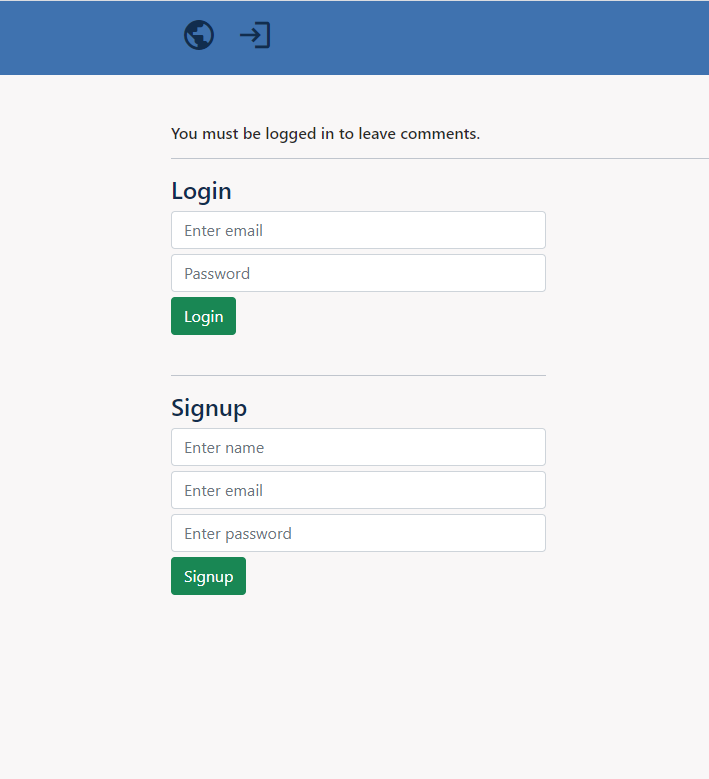
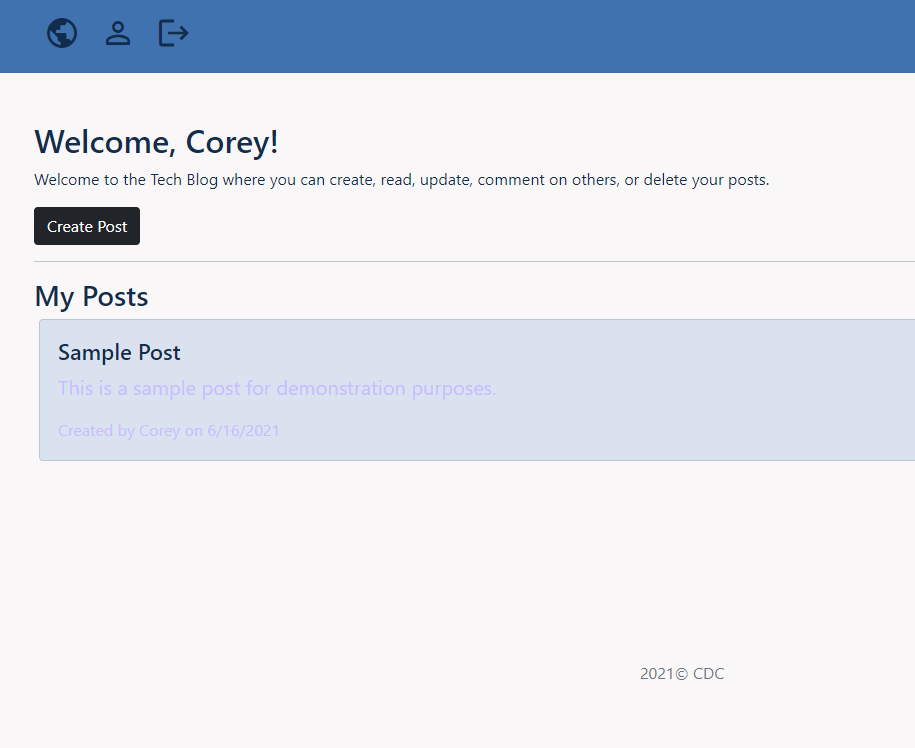

# Tech-Blog
Fullstack Bootcamp Homework

[](https://opensource.org/licenses/MIT)
    

## Description

A tech blog aplication with user login functionality.  Itmaintains a database of user credentials as well as posts made by individual users. 

## User Story

```md
AS A developer who writes about tech
I WANT a CMS-style blog site
SO THAT I can publish articles, blog posts, and my thoughts and opinions
```
      
## Table of Contents
1. [Install Instructions](#install-instructions)
2. [Usage Instructions](#usage-instructions)
3. [License](#license)
4. [Test Instructions](#test-instructions)
5. [Questions](#questions)

## Install Instructions

Navigate to https://intense-dusk-06192.herokuapp.com/

  
## Usage Instructions

View global posts on the home page. Login or signup to for accessand the ability to leave comments. Once logged in, navigate to the dashboard to view your posts, or create, update and delete posts.

## Images
</img>
</img>

## License
  
This application is licensed under MIT License.
     
[](https://opensource.org/licenses/MIT)
    

## Test Instructions

There are currently no tests.

## Questions

If you have any questions, contact the author:  

GitHub [@cdcolbert](https://github.com/cdcolbert)  
